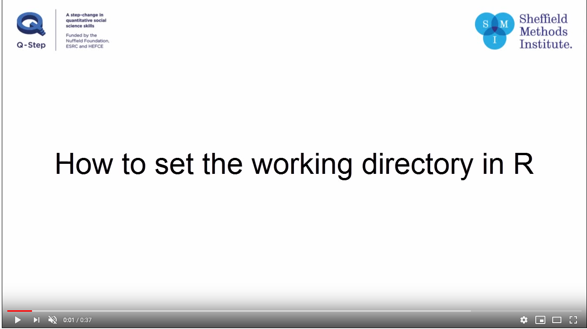

```{r setup, include=FALSE}
knitr::opts_chunk$set(echo = TRUE)
setwd('/Volumes/GoogleDrive/My Drive/Profissional/Pedagogico/UNICAMP/disciplinas/pos/R/lp192/intro_to_R1/Module_3')
input.dir <- "data"
my.files <- dir(input.dir, "\\.txt$")
corpus.list <- function(my.files, input.dir){
  #Creates an empty list 
  corpus.list <- list()
  # loop over the files
  for(i in 1:length(my.files)){
    # read the file in,  we need to know the input directory
    text.v <- scan(paste(input.dir, my.files[i], sep="/"),
                   what="character", sep="\n")
    #convert to single string
    text.v <- paste(text.v, collapse=" ")
    #lowercase and split on non-word characters
    text.lower.v <- tolower(text.v)
    text.words.v <- strsplit(text.lower.v, "\\W")
    text.words.v <- unlist(text.words.v)
    #remove the blanks
    text.words.v <- text.words.v[which(text.words.v!="")]
    #use the index id from the my.files vector as the "name" in the list
    corpus.list[[my.files[i]]] <- text.words.v
  }
  return(corpus.list)
}
```

# Introduction 

Today we are going to learn how to make concordances (KWIC), using R and no special package. This will take us two lessons, and possibly one class or more. Please, follow the instructions in this documentation if you have any doubts. 

This tutorial is based on:

> Jockers, Matthew Lee. 2014. *Text Analysis with R for Students of Literature: Quantitative Methods in the Humanities and Social Sciences*. Cham: Springer.

The ebook is available for UNICAMP students. To download it, you will need to access the [university's library](http://www.sbu.unicamp.br/sbu/) using our [VPN system](https://www.ccuec.unicamp.br/ccuec/servicos/acesso_remoto_vpn). 

In this tutorial, some new themes will be introduced:

1. Functions
    - A set of commands that are executed at once and applied in a file
2. Loops
    - A set of functions that are applied recursively. 

The data here is the same Jokers (2014) uses, but we might use a different dataset in classroom. 

## Before you start

Download the folder `data`, it is available in Module_3 root directory.

# Concordancing

## Step 1 reading files

Our fist step is to set up our work directory and a couple of variables. 

```{r setwd, echo=TRUE, eval=FALSE}

setwd("my directory")
input.dir <- "data"
my.files <- dir(input.dir, "\\.txt$")
```

Two things are important in the commands above

### setwd() and data file directory
`setwd()` is a command line instruction. It makes R point to a specific directory "*my directory*" where it reads information from and prints information to. It will be necessary that know precisely the address (path) of the directory in your computer and also it is imperative that you write it according to the Operation system notation you are using. 

**If you do not know how to write it, used the gear icon at Rstudio window to do so**. There you will see the option to set your work directory. Other option is to use the menu to change your working directory under Session > Set Working Directory > Choose Directory. 

A good example how todo so is presented by this video:


[](https://www.youtube.com/watch?v=QzSV8wvA1Do "How to set the working directory in RStudio")


`input.dir <- "data"` is an ordinary command that will make the directory `data` to be represented in one variable, while `my.files <- dir(input.dir, "\\.txt$")` will read all *txt* files in "data" as a variable. 

Note that we will be reading the files from inside our computer. 

## Creating our custom functions

Functions are chunks of codes that combine lines of code (redundant but correct) in order to make things faster and more automated. **R** comes with many pre-coded functions and, when we load a new package, it also brings a whole lot of new ones. However, sometimes, we either need some customised functions to perform a very specific function. 

For example, there is just one package that makes KWIC available in R [Quanteda](https://quanteda.io/). If this package's development is shut down for any reason, we might have to get a workaround. 

In the next tutorials we will see some more details about functions, now let us go to our concordancer. 

## Creating the base list()

Our fist step will be creating a function to make a `list()` out of my corpus. This list will be used for concordancing.

```{r F1, echo=TRUE, eval=FALSE}

corpus.list <- function(my.files, input.dir){
  "my code"
}
```

The chunk above shows us the basics of a function: 
`
1. The name of my function is `corpus.list`
1. `funtion()` defines that the following code will perform my function we named corpus.list`
    - the code between {…} will perform the function itself
    - The function will carry two arguments
        - `my.files` is the vector of files we created just above
        - `input.dir` is a vector with the name of the file's directory we created just above

So, let us star filling in the code:

```{r F2, echo=TRUE, eval=FALSE}
corpus.list <- function(my.files, input.dir){
  #Creates an empty list
  corpus.list <- list()
```


The command `corpus.list <- list()` creates a empty list I will "fill in" with my data. 

```{r F3, echo=TRUE, eval=FALSE}
corpus.list <- function(my.files, input.dir){
  #Creates an empty list 
  corpus.list <- list()
  # loop over the files
  for(i in 1:length(my.files)){
    # read the file in,  we need to know the input directory
    text.v <- scan(paste(input.dir, my.files[i], sep="/"),
                   what="character", sep="\n")
```

Then we created a loop. A loo is command that does an action recursively. We will discuss a it later, but for the time, it is important to notice:

`for` is a loop that applies a command for each element in a vector:

- So for each item `i` `in` the length of my vector "my files", it will paste the input directory followed my the name of the file. It will treat those names as `character` and separate them by a line feed `\n`.
- Finally it will be stored in a vector `text.v`
    

```{r F4, echo=TRUE, eval=FALSE}
corpus.list <- function(my.files, input.dir){
  #Creates an empty list 
  corpus.list <- list()
  # loop over the files
  for(i in 1:length(my.files)){
    # read the file in,  we need to know the input directory
    text.v <- scan(paste(input.dir, my.files[i], sep="/"),
                   what="character", sep="\n")
    #convert to single string
    text.v <- paste(text.v, collapse=" ")
    #lowercase and split on non-word characters
    text.lower.v <- tolower(text.v)
    text.words.v <- strsplit(text.lower.v, "\\W")
    text.words.v <- unlist(text.words.v)
    #remove the blanks
    text.words.v <- text.words.v[which(text.words.v!="")]
```

The code we added here makes a number of changes in our texts:

1. `text.v <- paste(text.v, collapse=" ")` converts it to a single character string
1. `text.lower.v <- tolower(text.v)` lowers all cases
1. `text.words.v <- strsplit(text.lower.v, "\\W")` breaks all strings by line and delete "non-words" characters
1. `text.words.v <- unlist(text.words.v)` unlists, so we do not have a list inside a list. 
1. `text.words.v <- text.words.v[which(text.words.v!="")]` removes all lines containing only spaces


```{r F5, echo=TRUE, eval=FALSE}
corpus.list <- function(my.files, input.dir){
  #Creates an empty list 
  corpus.list <- list()
  # loop over the files
  for(i in 1:length(my.files)){
    # read the file in,  we need to know the input directory
    text.v <- scan(paste(input.dir, my.files[i], sep="/"),
                   what="character", sep="\n")
    #convert to single string
    text.v <- paste(text.v, collapse=" ")
    #lowercase and split on non-word characters
    text.lower.v <- tolower(text.v)
    text.words.v <- strsplit(text.lower.v, "\\W")
    text.words.v <- unlist(text.words.v)
    #remove the blanks
    text.words.v <- text.words.v[which(text.words.v!="")]
    #use the index id from the my.files vector as the "name" in the list
    corpus.list[[my.files[i]]] <- text.words.v
  }
  return(corpus.list)
}
```

Now changes now are:

1. `corpus.list[[my.files[i]]] <- text.words.v` used the my.files index to name the elements in my list accordingly
1. `return(corpus.list)` returns my final list as the result

Now all I have to do is to run it:

```{r F6}
my.corpus.list <- corpus.list(my.files, input.dir)
```

The results are:
```{r F7}
str(my.corpus.list)
```

## Observing postions

Now we can observe in which positions a given word is in our novels:

```{r elinor}
e.positions.sense <- which(my.corpus.list[[1]][]=="women")
head(e.positions.sense,15)
```

```{r wale}
d.positions.moby <- which(my.corpus.list[[2]][]=="dog")
head(d.positions.moby,15)
```

## Let us make a concordance

For concordancing, we will be using the vector positions we just created and a new loop:

```{r loop1}
# setting the context
context <- 5
for(i in 1:length(e.positions.sense)){
start <- e.positions.sense[i]-context
end <- e.positions.sense[i]+context
cat(my.corpus.list[[1]][start:end], "\n")
}
```
If we beak this looping:

1. `context <- 5` sets the KWIC to be five words long
1. `for(i in 1:length(e.positions.sense))` tells that from one up to the length of `e.positions.sense` the computer should apply this loop
1. `start <- e.positions.sense[i]-context` the start of my line is the  occurrence of women, and it should consider five words to the left
1. `end <- e.positions.sense[i]+context` the end of my line is the  occurrence of women, and it should consider five words to the right
1. `cat(my.corpus.list[[1]][start:end], "\n")` searches in the fist element of my list and prints it in the console


Now for Moby Dick, the same loop
```{r loop2}
# setting the context
context <- 5
for(i in 1:length(e.positions.sense)){
start <- e.positions.sense[i]-context
end <- e.positions.sense[i]+context
cat(my.corpus.list[[1]][start:end], "\n")
}
```

However, it is not aesthetically pleasing, so I will modify the code a little:

```{r loop3}
for(i in 1:length(d.positions.moby)){
  start <- d.positions.moby[i]-context
  end <- d.positions.moby[i]+context
  before <- my.corpus.list[[2]][start:(start+context-1)]
  after <- my.corpus.list[[2]][(start+context+1):end]
  keyword <- my.corpus.list[[2]][start+context]
  cat("----------------------", i, "----------------------", "\n")
  cat(before,"[",keyword, "]", after, "\n")
}
```

Some little changes make all the difference:

1. the line `cat("---i---","\n")` inserted a line between each occurrence
1. `cat(before,"[",keyword, "]", after, "\n")` made the KWIC to be displayed between squared brackets


