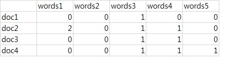
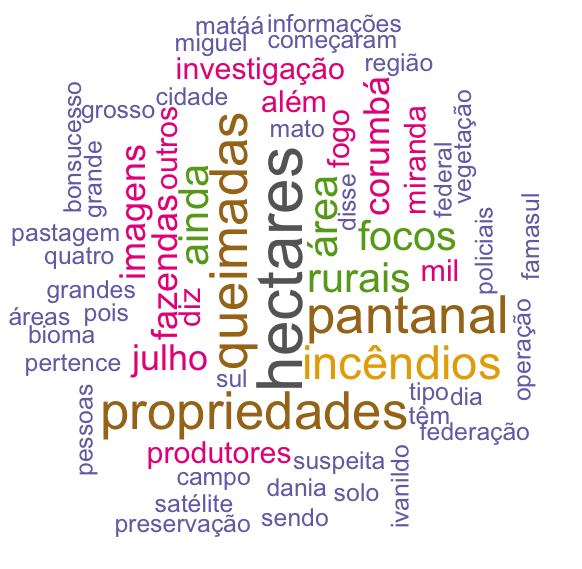

Rodrigo Esteves de Lima Lopes \
*Campinas State University* \
[rll307@unicamp.br](mailto:rll307@unicamp.br)


# Making a Word Cloud

# Introduction 

In this tutorial we are going to

1. Have our first introduction to the package `tm`
    -  A very relevant package for corpus analysis
1. Make a word cloud
    - A common resource on text analysis
    
It is important to observe that a word cloud can be done using any word list in a data frame format. The ones we created in the last tutorials are just fine. I will take the opportunity to introduce some new techniques. Remember that some of these new commands might produce similar results to the ones we have got earlier, however it is always important to know different ways of doing things in R. 


# Packages

For these exercise we will need three packages:

1. wordcloud
    - Responsible for making the word cloud
1. RColorBrewer
    - For colour choosing
1. tm
    - For text processing
    
So load the packages


```r
library(wordcloud)
library(RColorBrewer)
library(tm)
```

# Text processing 
## Importing the texts

We will import the following texts to our anlysis

- g1: a piece of news in Brazilian Portuguese
- elpais: a piece of news in Spanish

I `RStudio` run the lines bellow to import each text a a vector. 


```r
g1 <-readLines('G1.txt')
elpais <-readLines('elpais.txt')
```

## Making a corpus

A corpus is a king of object in R that contains information regarding a text or set of texts we are analysing. Each text mining package creates an specific corpus object, so they cannot be recycled across packages. The following command makes the corpus objects: 

1. `Corpus`: construes the corpus
1. `VectorSource`: tells `Corpus` that my source is a vector

Please, run:


```r
g1.corpus <- Corpus(VectorSource(g1))
elpais.corpus <- Corpus(VectorSource(elpais))
```


## Manipulating the corpus

Now we are going to have a couple of actions that will change the way our corpus is. The command above will transform my corpus into a lower case one. I am doing so because we are not interested in studying case differences:


```r
g1.corpus <- tm_map(g1.corpus, content_transformer(tolower))
elpais.corpus <- tm_map(elpais.corpus, content_transformer(tolower))
```

Our next step is to remove the numbers:


```r
g1.corpus <- tm_map(g1.corpus, removeNumbers)
elpais.corpus <- tm_map(elpais.corpus, removeNumbers)
```

Now I am cleaning my corpus out of stopwords. Please notice that `tm` brings a set of stopwords pre-loaded, so I do not need to provide my own. Actually, I can save them to a vector if a like. 


```r
#stopwords
g1.corpus <- tm_map(g1.corpus, removeWords, stopwords("portuguese"))
elpais.corpus <- tm_map(elpais.corpus, removeWords, stopwords("spanish"))
```
Now we are going to delete the empty space in the corpus:


```r
#No numbers
g1.corpus <- tm_map(g1.corpus, stripWhitespace)
elpais.corpus <- tm_map(elpais.corpus, stripWhitespace)
```

Now we will be removing punctuation. It is now our concern in this tutorial


```r
g1.corpus <- tm_map(g1.corpus, removePunctuation)
elpais.corpus <- tm_map(elpais.corpus, removePunctuation)
```

Now we are going to transform our text in Document Term Matrix, or a bag of words. In a illustration it will be something similar to:



Please, run:


```r
g1.dtm <- TermDocumentMatrix(g1.corpus)
elpais.dtm <- TermDocumentMatrix(elpais.corpus)
```

Now we will convert it into a matrix, so we will make a wordlist latter:


```r
g1.m <- as.matrix(g1.dtm)
elpais.m <- as.matrix(elpais.dtm)
```

In the following set of commands I will:

1. Count the words in each matrix
1. Sort them numerically
1. Create a data frame
1. Delete a couple of unwanted columns


```r
g1.m <- as.matrix(g1.dtm)
elpais.m <- as.matrix(elpais.dtm)

g1.v <- sort(rowSums(g1.m),decreasing=TRUE)
elpais.v <- sort(rowSums(elpais.m),decreasing=TRUE)

g1.df <- data.frame(word = names(g1.v ),freq=g1.v)
g1.df<- g1.df[-5,]

elpais.df <- data.frame(word = names(elpais.v ),freq=elpais.v)
elpais.df <- elpais.df[-11,]
```

Finally my wordlists will look like this:


```r
load("data/wordcloud/data.Rdata")
head(elpais.df)
```

```
##                word freq
## pantanal   pantanal   11
## incendios incendios   11
## fuego         fuego   10
## gobierno   gobierno    9
## millones   millones    9
## grosso       grosso    8
```

```r
head(g1.df)
```

```
##                      word freq
## hectares         hectares   10
## pantanal         pantanal    8
## queimadas       queimadas    8
## propriedades propriedades    8
## incêndios       incêndios    7
## rurais             rurais    6
```

# Creating the word clouds

Now we will create a word cloud for each text:


```r
set.seed(1234)
wordcloud(words = g1.df$word, freq = g1.df$freq, min.freq = 3,
          max.words=100, random.order=FALSE, rot.per=0.35, 
          colors=brewer.pal(8, "Dark2"))
```

The result will be something like:




Now we run:


```r
wordcloud(words = elpais.df$word, freq = elpais.df$freq, min.freq = 3,
          max.words=100, random.order=FALSE, rot.per=0.35, 
          colors=brewer.pal(8, "Dark2"))
```


and the result will be something like:


