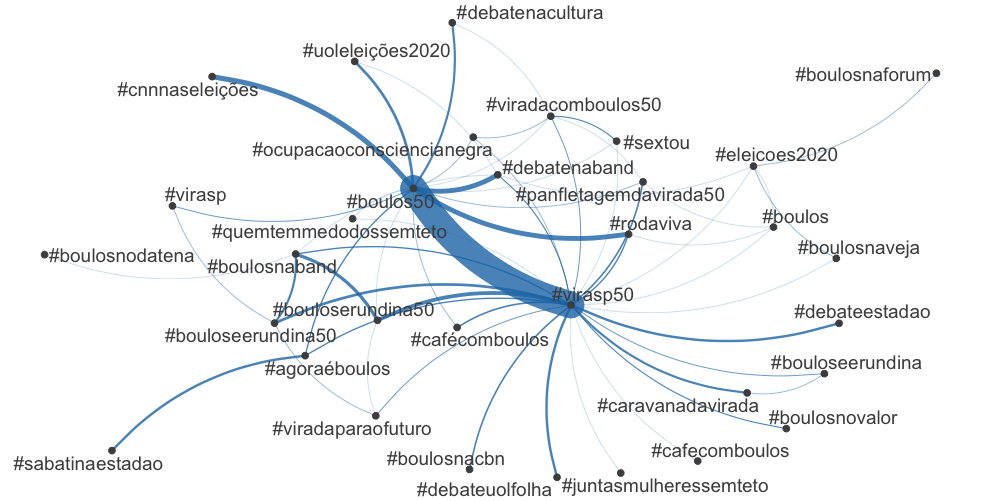
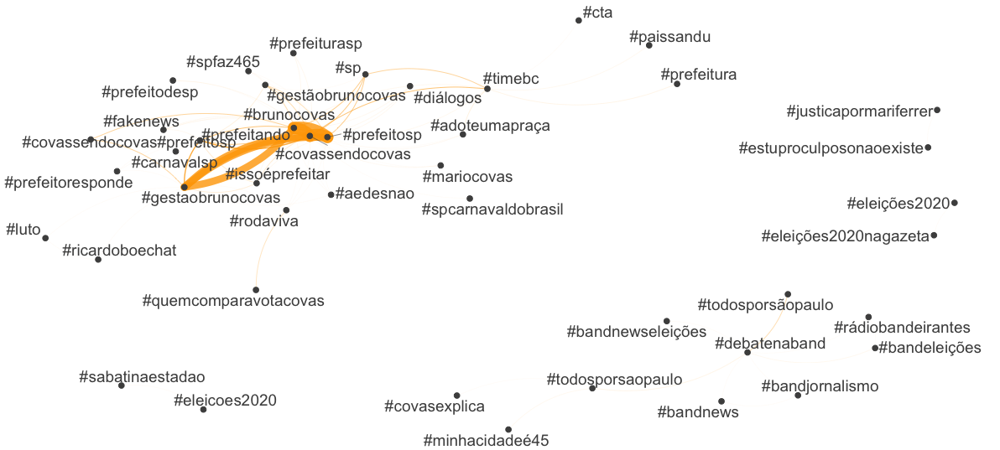
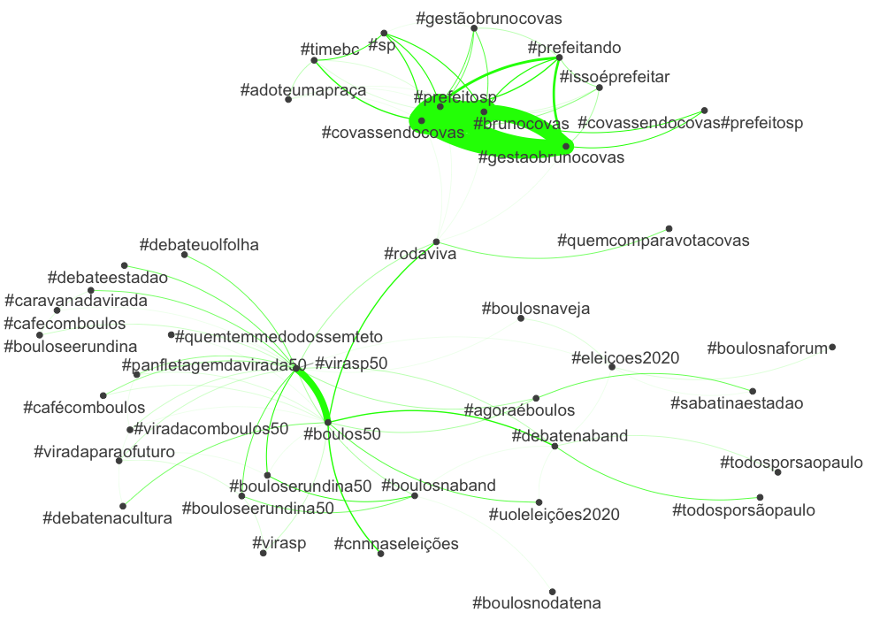
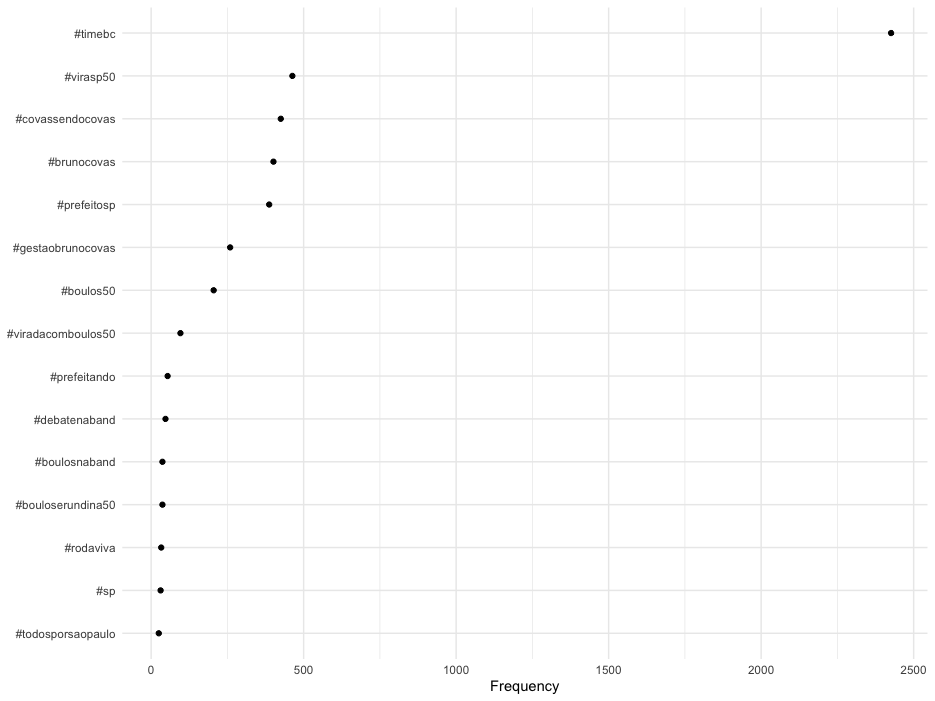
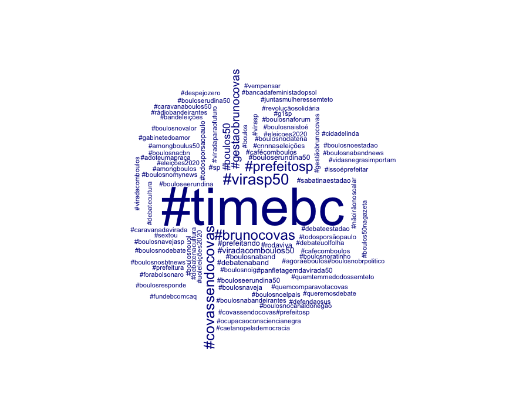
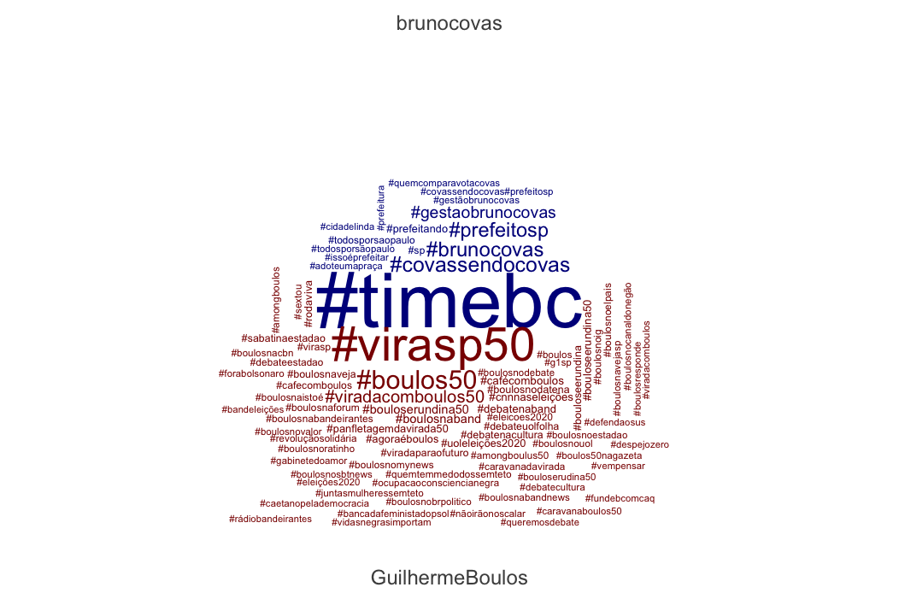

```{r setup, include=FALSE}
knitr::opts_chunk$set(echo = TRUE)
knitr::opts_chunk$set(fig.pos = "!H", out.extra = "")
library(rtweet)
load("/Volumes/GoogleDrive/My Drive/Profissional/Pedagogico/UNICAMP/disciplinas/pos/R/lp192/intro_to_R1/Module_3/data/quanteda/prefeitura.RData")
```

# Introduction

[Quanteda](https://quanteda.io/) is a package for managing and analyse text quantitatively. It is quite easy to use and will bring us a number of interesting functions. 

## You will need:

1. The package [`Quanteda`](https://quanteda.io/), which can be installed using [RStudio](http://www.sthda.com/english/wiki/installing-and-using-r-packages)
1. The package `rtweet`, we installed (last tutorial)[https://github.com/MiDiTeS/intro_to_R1/blob/master/Module_3/04_rtweet.md]. 
1. Package `DT` for viewing the KWIC inside R. 

# Scraping Tweets

I will download two [Twitter](https://twitter.com/) timelines: [@GuilhermeBoulos](https://twitter.com/GuilhermeBoulos) and [@brunocovas](https://twitter.com/brunocovas). Both are candidates in the second round of São Paulo's mayor elections. 

```{r, scraping, eval=FALSE,echo=TRUE}
library(rtweet)
covas <- get_timelines("brunocovas", n = 3200)
boulos <- get_timelines("GuilhermeBoulos", n = 3200)
boulos_and_covas <-rbind(covas,boulos)
```
                        
If you want to download the same data I used in this tutorial, there is a image saved on data/quanteda directory. 

# Doing some analysis

## Creating the corpora

We are now creating three corpora:

1. Boulos's Tweets
1. Cova's Tweets
1. All together

```{r creating.corpora, eval=FALSE,echo=TRUE}
boulos.corpus<-corpus(boulos)
covas.corpus<-corpus(covas)
all.corpora<-corpus(boulos_and_covas)
```

## Creating a network of hashtags for each candidate

```{r DFM1, eval=FALSE,echo=TRUE}
boulos.dfm<-dfm(boulos.corpus, 
                remove_punct = TRUE,
                case_insensitive=TRUE,
                remove = stopwords("portuguese"),verbose = TRUE)
covas.dfm<-dfm(covas.corpus, 
               remove_punct = TRUE,
               case_insensitive=TRUE,
               remove = stopwords("portuguese"),
               verbose = TRUE)
all.dfm<-dfm(all.corpora, 
             remove_punct = TRUE,
             case_insensitive=TRUE,
             remove = stopwords("portuguese"),
             verbose = TRUE)
```

```{r,view_DFM1}
head(boulos.dfm,5)
```

```{r,view_DFM2}
head(all.dfm,5)
```

## Analysing some hashtags

Frist we will do the magic for Guilherme Boulos. We are going to:

1. Select the hashtags using the command `dfm_select`
1. Select the 50 more frequent using `topfeatures` command

```{r, hash01,eval=FALSE,echo=TRUE}
tag.dfm.boulos <- dfm_select(boulos.dfm, pattern = ("#*"))
toptag.boulos <- names(topfeatures(tag.dfm.boulos, 50))
```

Let us see the result:

```{r view_hash01}
head(toptag.boulos)
```


Now let us construct a feature-occurrence matrix for the hashtags

```{r hash02,eval=FALSE,echo=TRUE}
tag_fcm.boulos <- fcm(tag.dfm.boulos)
```

Now let us see it:
```{r view_hash02}
head(tag_fcm.boulos)
```

First let us make a FCM only with the top hashtags

```{r top_boulos_f, eval=FALSE,echo=TRUE}
topgat_fcm.boulos <- fcm_select(tag_fcm.boulos, pattern = toptag.boulos )
```

And then we make our network

```{r top_boulos_n, eval=FALSE,echo=TRUE}
textplot_network(topgat_fcm.boulos, 
                 min_freq = 0.1, 
                 edge_alpha = 0.8, 
                 edge_size = 5)
```

Let us see how is the final product



Now let us see how it works for Covas, all in a single batch of commands:

```{r covas_net,eval=FALSE,echo=TRUE}
tag.dfm.covas <- dfm_select(covas.dfm, pattern = ("#*"))
toptag.covas <- names(topfeatures(tag.dfm.covas, 50))
tag_fcm.covas <- fcm(tag.dfm.covas)
topgat_fcm.covas <- fcm_select(tag_fcm.covas, pattern = toptag.covas )
textplot_network(topgat_fcm.covas, 
                 min_freq = 0.1, 
                 edge_alpha = 0.8, 
                 edge_size = 5, 
                 edge_color = "orange")
```



Now let us do the two together. Again in a single script:

```{r net_all, eval=FALSE,echo=TRUE}
tag.dfm.all <- dfm_select(all.dfm, pattern = ("#*"))
toptag.all <- names(topfeatures(tag.dfm.all, 50))
tag_fcm.all <- fcm(tag.dfm.all)
topgat_fcm.all <- fcm_select(tag_fcm.all, pattern = toptag.all )
textplot_network(topgat_fcm.all, min_freq = 0.1, 
                 edge_alpha = 1, 
                 edge_size = 10, 
                 edge_color = "green")
```

And the result is bellow 



## New ways to compare

Now let us make a new graphic. Here we are counting the importance of each hashtag. 

```{r counting, eval=FALSE,echo=TRUE}
tstat_freq <- textstat_frequency(tag.dfm.all, n = 15, groups = "screen_name")
```

Then we do some coding using `ggplot2`, so we can see how it looks like:

```{r plot_01, eval=FALSE,echo=TRUE}
library(ggplot2)
tag.dfm.all %>% 
  textstat_frequency(n = 15) %>% 
  ggplot(aes(x = reorder(feature, frequency), y = frequency)) +
  geom_point() +
  coord_flip() +
  labs(x = NULL, y = "Frequency") +
  theme_minimal()
```

The expected result would be something similar to this:



Now, let us make a general cloud of hashtags:

```{r cloud01,eval=FALSE,echo=TRUE}
set.seed(132)
textplot_wordcloud(tag.dfm.all, max_words = 100)
```

And the result should be somesthing similar to this:



This code will make some comparison:

```{r, dfm_cloud,eval=FALSE,echo=TRUE}
dfm.hash.all <- dfm(all.corpora, select = "#*", groups = "screen_name")
```

Now we plot it:
```{r plot_cloud_all2,eval=FALSE,echo=TRUE}
textplot_wordcloud(dfm.hash.all, 
                   comparison = TRUE, 
                   max_words = 200,
                   color = c("darkblue", "darkred"))
```




