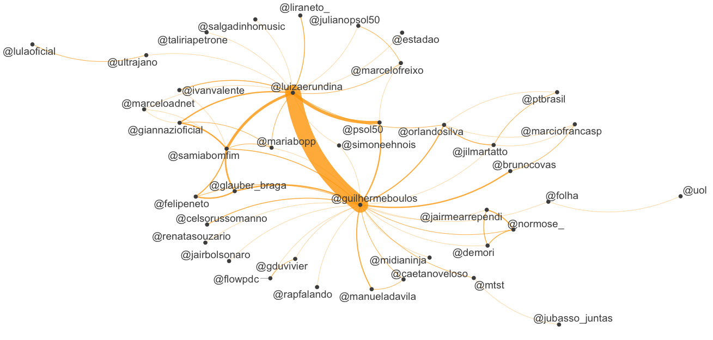
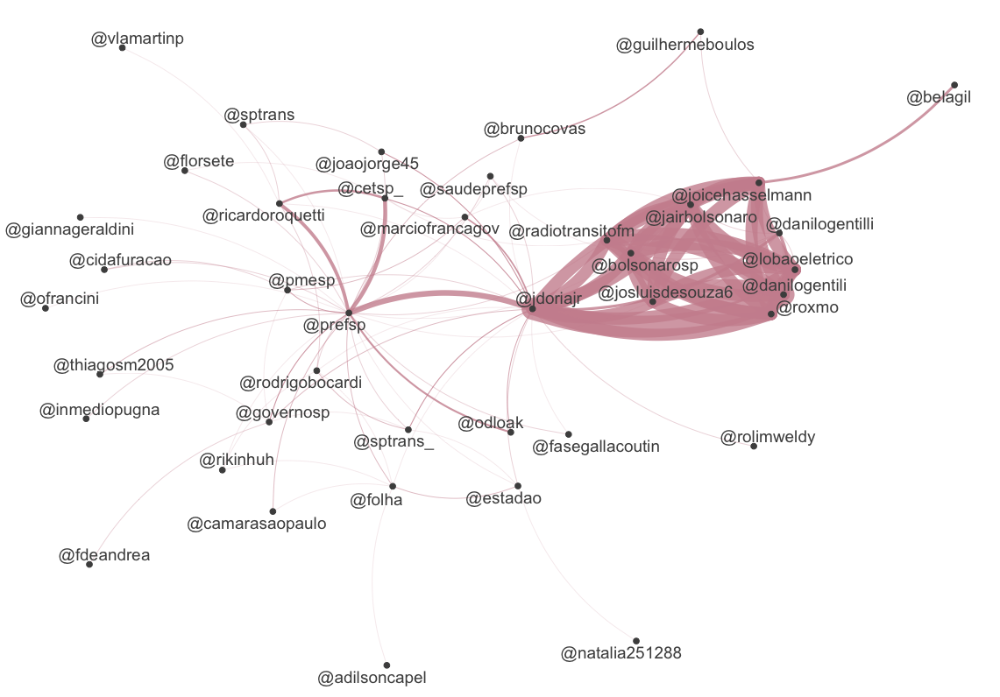

# Quanteda and Twitter 

Rodrigo Esteves de Lima Lopes \
*Campinas State University* \
[rll307@unicamp.br](mailto:rll307@unicamp.br)

# Introduction

[Quanteda](https://quanteda.io/) is a package for managing and analyse text quantitatively. It is quite easy to use and will bring us a number of interesting functions. 

## You will need:

1. The package [`Quanteda`](https://quanteda.io/), which can be installed using [RStudio](http://www.sthda.com/english/wiki/installing-and-using-r-packages)
1. The package `rtweet`, we installed [last tutorial](https://github.com/MiDiTeS/intro_to_R1/blob/master/Module_3/04_rtweet.md). 
1. Package `DT` for viewing the KWIC inside R. 

# Scraping Tweets

I will download two [Twitter](https://twitter.com/) timelines: [GuilhermeBoulos](https://twitter.com/GuilhermeBoulos) and [brunocovas](https://twitter.com/brunocovas). Both are candidates in the second round of São Paulo's mayor elections. 


```r
library(rtweet)
covas <- get_timelines("brunocovas", n = 3200)
boulos <- get_timelines("GuilhermeBoulos", n = 3200)
boulos_and_covas <-rbind(covas,boulos)
```
                        
If you want to download the same data I used in this tutorial, there is a image saved on data/quanteda directory. 

# Doing some analysis

## Creating the corpora

We are now creating three corpora:

1. Boulos's Tweets
1. Cova's Tweets
1. All together


```r
boulos.corpus<-corpus(boulos)
covas.corpus<-corpus(covas)
all.corpora<-corpus(boulos_and_covas)
```

## Creating a network of hashtags for each candidate


```r
boulos.dfm<-dfm(boulos.corpus, 
                remove_punct = TRUE,
                case_insensitive=TRUE,
                remove = stopwords("portuguese"),verbose = TRUE)
covas.dfm<-dfm(covas.corpus, 
               remove_punct = TRUE,
               case_insensitive=TRUE,
               remove = stopwords("portuguese"),
               verbose = TRUE)
all.dfm<-dfm(all.corpora, 
             remove_punct = TRUE,
             case_insensitive=TRUE,
             remove = stopwords("portuguese"),
             verbose = TRUE)
```


```r
head(boulos.dfm,5)
```

```
## Loading required package: quanteda
```

```
## Package version: 2.1.2
```

```
## Parallel computing: 2 of 4 threads used.
```

```
## See https://quanteda.io for tutorials and examples.
```

```
## 
## Attaching package: 'quanteda'
```

```
## The following object is masked from 'package:utils':
## 
##     View
```

```
## Document-feature matrix of: 5 documents, 11,372 features (99.9% sparse) and 89 docvars.
##        features
## docs    psdb entrou vale tudo folha revela assessora gabinete covas enviou
##   text1    1      1    1    1     1      1         1        1     1      1
##   text2    0      0    0    0     0      0         0        0     0      0
##   text3    0      0    0    0     0      0         0        0     0      0
##   text4    0      0    0    0     0      0         0        0     0      0
##   text5    0      0    0    0     0      0         0        0     1      0
## [ reached max_nfeat ... 11,362 more features ]
```


```r
head(all.dfm,5)
```

```
## Document-feature matrix of: 5 documents, 16,947 features (99.9% sparse) and 89 docvars.
##        features
## docs    nova rodada ibope confirma @brunocovas liderança isolada paulo mostra
##   text1    1      1     1        1           1         1       1     1      1
##   text2    0      0     0        0           0         0       0     1      0
##   text3    0      0     0        0           0         0       0     1      0
##   text4    0      0     0        0           0         0       0     1      0
##   text5    0      0     0        0           1         0       0     1      0
##        features
## docs    confia
##   text1      1
##   text2      0
##   text3      0
##   text4      0
##   text5      0
## [ reached max_nfeat ... 16,937 more features ]
```

## Analysing some hashtags

Frist we will do the magic for Guilherme Boulos. We are going to:

1. Select the hashtags using the command `dfm_select`
1. Select the 50 more frequent using `topfeatures` command


```r
tag.dfm.boulos <- dfm_select(boulos.dfm, pattern = ("#*"))
toptag.boulos <- names(topfeatures(tag.dfm.boulos, 50))
```

Let us see the result:


```r
head(toptag.boulos)
```

```
## [1] "#virasp50"          "#boulos50"          "#viradacomboulos50"
## [4] "#bouloserundina50"  "#boulosnaband"      "#debatenaband"
```


Now let us construct a feature-occurrence matrix for the hashtags


```r
tag_fcm.boulos <- fcm(tag.dfm.boulos)
```

Now let us see it:

```r
head(tag_fcm.boulos)
```

```
## Feature co-occurrence matrix of: 6 by 6 features.
##                            features
## features                    #boulos50 #virasp50 #virasp #viradailustrada50
##   #boulos50                         0       109       3                  1
##   #virasp50                         0         1       0                  1
##   #virasp                           0         0       0                  0
##   #viradailustrada50                0         0       0                  0
##   #mulheresnocorrecomboulos         0         0       0                  0
##   #quemtemmedodossemteto            0         0       0                  0
##                            features
## features                    #mulheresnocorrecomboulos #quemtemmedodossemteto
##   #boulos50                                         1                      1
##   #virasp50                                         1                      1
##   #virasp                                           0                      0
##   #viradailustrada50                                1                      0
##   #mulheresnocorrecomboulos                         0                      0
##   #quemtemmedodossemteto                            0                      0
```

First let us make a FCM only with the top hashtags


```r
topgat_fcm.boulos <- fcm_select(tag_fcm.boulos, pattern = toptag.boulos )
```

And then we make our network


```r
textplot_network(topgat_fcm.boulos, 
                 min_freq = 0.1, 
                 edge_alpha = 0.8, 
                 edge_size = 5)
```

Let us see how is the final product


Now let us see how it works for Covas, all in a single batch of commands:


```r
tag.dfm.covas <- dfm_select(covas.dfm, pattern = ("#*"))
toptag.covas <- names(topfeatures(tag.dfm.covas, 50))
tag_fcm.covas <- fcm(tag.dfm.covas)
topgat_fcm.covas <- fcm_select(tag_fcm.covas, pattern = toptag.covas )
textplot_network(topgat_fcm.covas, 
                 min_freq = 0.1, 
                 edge_alpha = 0.8, 
                 edge_size = 5, 
                 edge_color = "orange")
```


Now let us do the two together. Again in a single script:


```r
tag.dfm.all <- dfm_select(all.dfm, pattern = ("#*"))
toptag.all <- names(topfeatures(tag.dfm.all, 50))
tag_fcm.all <- fcm(tag.dfm.all)
topgat_fcm.all <- fcm_select(tag_fcm.all, pattern = toptag.all )
textplot_network(topgat_fcm.all, min_freq = 0.1, 
                 edge_alpha = 1, 
                 edge_size = 10, 
                 edge_color = "green")
```

And the result is bellow 


## New ways to compare

Now let us make a new graphic. Here we are counting the importance of each hashtag. 


```r
tstat_freq <- textstat_frequency(tag.dfm.all, 
                                 n = 15, groups = "screen_name")
```

Then we do some coding using `ggplot2`, so we can see how it looks like:


```r
library(ggplot2)
tag.dfm.all %>% 
  textstat_frequency(n = 15) %>% 
  ggplot(aes(x = reorder(feature, frequency), 
             y = frequency)) +
  geom_point() +
  coord_flip() +
  labs(x = NULL, y = "Frequency") +
  theme_minimal()
```

The expected result would be something similar to this:


Now, let us make a general cloud of hashtags:


```r
set.seed(132)
textplot_wordcloud(tag.dfm.all, max_words = 100)
```

And the result should be somesthing similar to this:


This code will make some comparison:


```r
dfm.hash.all <- dfm(all.corpora, select = "#*", groups = "screen_name")
```

Now we plot it:

```r
textplot_wordcloud(dfm.hash.all, 
                   comparison = TRUE, 
                   max_words = 200,
                   color = c("darkblue", "darkred"))
```


## Analysing user interactions

We can use the same methodology to study users interaction. The difference we are going to change the search for `*#` to `*@`. Let us start by Guilherme Boulos, but in a single command:


```r
boulos.user.dfm <- dfm_select(boulos.dfm, pattern = "@*")
topuser.boulos <- names(topfeatures(boulos.user.dfm, 50))
View(topuser.boulos)

boulos.user.fcm <- fcm(boulos.user.dfm)
View(boulos.user.fcm)

boulos.user.plot <- fcm_select(boulos.user.fcm, pattern = topuser.boulos)
textplot_network(boulos.user.plot, min_freq = 0.1, 
                 edge_color = "orange", edge_alpha = 0.8, 
                 edge_size = 5)
```


The result would be something similar to it:


Now let us do the same for Bruno Covas


```r
covas.user.dfm <- dfm_select(covas.dfm, pattern = "@*")
topuser.covas <- names(topfeatures(covas.user.dfm, 50))
head(topuser.covas)

covas.user.fcm <- fcm(covas.user.dfm)
View(covas.user.fcm)

covas.user.plot <- fcm_select(covas.user.fcm, 
                              pattern = topuser.covas)
textplot_network(covas.user.plot, 
                 min_freq = 0.1, 
                 edge_color = "pink3", 
                 edge_alpha = 0.8, 
                 edge_size = 5)
```


The result should be something similar to:




