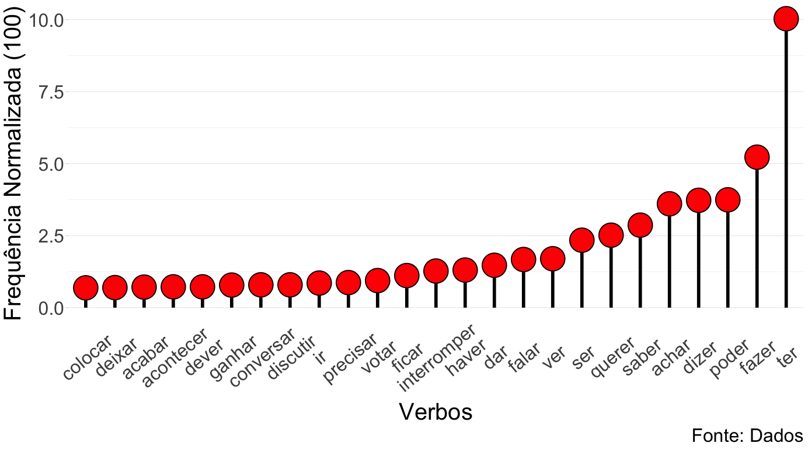

# Tagging text data

Rodrigo Esteves de Lima Lopes \
*Campinas State University* \
[rll307@unicamp.br](mailto:rll307@unicamp.br

# Introduction

In this tutorial, we are going to use a `NLP` package called [UDPipe](https://cran.r-project.org/web/packages/udpipe/vignettes/udpipe-annotation.html) in order to tag a number of texts using POF (par of speech) methodology. We are going to recycle some data from our last tutorial (Lula's interview by Roda Viva). 

# Packages

In this tutorial we will need the following packages:


```r
# Packages
library(ggplot2)
library(udpipe)
library(textrank)
library(dplyr)
library(forcats)
```

# Analysing the texts

After I load the packages above, my first step is to download the models for text analysis. Here we are going to work with Brazilian Portuguese. 


```r
#Downloading the model
ud_model <- udpipe_download_model(language = "portuguese")
ud_model <- udpipe_load_model(ud_model$file_model)
```

Our next step is to load the data we used last tutorial


```r
# Loading the interviews 
load('./data/02_scrape_html.RData')
```


Our next step is tagging the corpus. In the command below:

- `ud_model` is the model we just downloaded and loaded.
- `x` is the interviews data frame, please note we are using only the column text.
- `doc_id` is a filed to identify the texts. Here we are using the title of the interviews, but it might be any info you see fit
- `as.data.frame()` is to save the data in a more friendly format


```r
Tagged.Interviews <- udpipe_annotate(ud_model,  
                          x=base$Text, 
                          doc_id = base$Title) %>% as.data.frame()
```

## Which are the most frequent verbs?


```r
Verbs <- subset(Tagged.Interviews, upos %in% c("VERB")) 
Verbs  <- txt_freq(Verbs$lemma)
Verbs.top <- Verbs[1:25,]
```

Plotting


```r
Verbs.top%>%
  mutate(key = fct_reorder(key, freq_pct)) %>%
  ggplot(., aes(x = key, y = freq_pct, fill=key)) +
  geom_segment(aes(x=key, xend=key, y=0, yend=freq_pct),
               color="black",size = 2) +
  geom_point(shape = 21, color="black",
             fill ='#FF0000',
             size=14, stroke = 1) +
  theme_light() +
  labs(caption="Fonte: Dados",
       x = "Verbos",
       y = "Frequência Normalizada (100)") +
  theme(axis.text.x = element_text(angle=40, vjust=0.6),
        legend.position = "none",
        panel.grid.major.x = element_blank(),
        panel.border = element_blank(),
        axis.ticks.x = element_blank(),
        text = element_text(size=30))
```

The result should be like:



## Relationship (verbs and nouns)


```r
# Observing verbs+nouns 
sub_verb <- keywords_phrases(x = Tagged.Interviews$upos,
                             term = tolower(Tagged.Interviews$token),
                             pattern = "NOUN+VERB",
                             is_regex = TRUE,
                             detailed = FALSE)
```

## Observing (nouns and adjectives)


```r
sub.adj <- keywords_phrases(x = Tagged.Interviews$upos,
                            term = tolower(Tagged.Interviews$token),
                            pattern = "NOUN+ADJ",
                            is_regex = TRUE,
                            detailed = FALSE)
```

## Collocates


```r
collocates<-collocation(Tagged.Interviews,
                        term="lemma",
                        group="doc_id",
                        ngram_max = 3,
                        n_min = 2,
                        sep = " ")
```

## Matrix and correlation


```r
x <- document_term_frequencies(Tagged.Interviews[, c("doc_id", "lemma")])
dtm <- document_term_matrix(x)
correlation<-dtm_cor(dtm)
```


